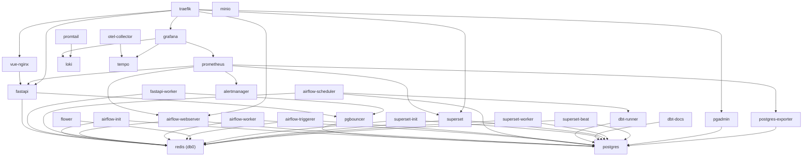

# Current Runtime Architecture

This document describes the current Docker Compose architecture used by Vortex.
The root orchestrator is `compose.yml` using Compose `include` to load service-specific `*/compose.yml` files.

## Service Topology Diagram

## Service Connection Map

- `postgres`: receives connections from `pgbouncer`, Airflow services, Superset services, `dbt-runner`, `dbt-docs`, `pgadmin`, and `postgres-exporter`.
- `pgbouncer`: receives DB traffic from `fastapi` and `fastapi-worker`, forwards to `postgres`.
- `redis`: receives queue/broker traffic from `fastapi`, `fastapi-worker`, Airflow services, Superset services, and `flower`.
- `fastapi`: receives HTTP from `vue-nginx` (and optionally Traefik), writes queue messages to Redis, reads/writes relational data through PgBouncer.
- `fastapi-worker`: consumes Redis queue messages and writes to Postgres through PgBouncer.
- `vue-nginx`: serves frontend, calls `fastapi` backend.
- `airflow-init`: one-time metadata/admin bootstrap against Postgres + Redis.
- `airflow-webserver`: Airflow UI/API, backed by Postgres + Redis.
- `airflow-scheduler`: schedules DAGs and coordinates work via Postgres + Redis; triggers dbt DAG runs.
- `airflow-worker`: executes Celery tasks using Redis broker and Postgres metadata.
- `airflow-triggerer`: handles deferrable tasks; uses Postgres + Redis.
- `flower`: observes Airflow Celery workers through Redis broker.
- `dbt-runner`: on-demand transform execution against Postgres.
- `dbt-docs`: serves dbt docs and reads dbt metadata/project context.
- `superset-init`: one-time metadata/admin bootstrap against Postgres + Redis.
- `superset`: BI UI/API backed by Postgres metadata and Redis async channels.
- `superset-worker`: async query/background worker using Redis + Postgres.
- `superset-beat`: periodic Superset jobs using Redis + Postgres.
- `pgadmin`: admin UI connecting directly to Postgres.
- `prometheus`: scrapes metrics targets (`prometheus`, `postgres-exporter`, `fastapi`, `airflow-webserver`, `superset`) and forwards alerts to `alertmanager`.
- `alertmanager`: receives alerts from Prometheus and routes notifications.
- `postgres-exporter`: reads Postgres metrics and exposes them to Prometheus.
- `grafana`: queries Prometheus (metrics), Loki (logs), and Tempo (traces) for dashboards.
- `loki`: receives logs from Promtail.
- `promtail`: tails host/container logs and pushes to Loki.
- `tempo`: trace backend, receives telemetry from `otel-collector`.
- `otel-collector`: telemetry pipeline that exports traces to Tempo.
- `traefik`: optional edge proxy routing to selected internal UIs/APIs.
- `minio`: S3-compatible object store service (currently standalone in this topology).

## Core Data and Queue Plane

### `postgres`
- System-of-record relational database for application, analytics, and metadata domains.
- Custom image: `vortex-postgres`.
- Backed by the `postgres` volume.
- Hosts multiple logical databases used by the stack (for example Vortex app data, Airflow metadata DB, Superset metadata DB).

### `pgbouncer`
- Connection pooler in front of Postgres for high-concurrency API workloads.
- Custom image: `vortex-pgbouncer` (PgBouncer `1.25.2`).
- Exposes host port `6432` and forwards to Postgres.
- Used by FastAPI services (`fastapi`, `fastapi-worker`) to reduce direct connection churn.

### `redis`
- Shared in-memory broker/cache used by async components.
- Custom image: `vortex-redis`.
- Backed by the `redis` volume.
- Logical DB usage:
- `0`: FastAPI worker queue and app async messaging.
- `2`: Airflow Celery broker (and Flower when enabled).
- Also used by Superset task workers.

## Application Runtime

### `fastapi`
- Primary backend API service (`uvicorn`).
- Custom image: `vortex-fastapi`.
- Depends on Postgres (through PgBouncer) and Redis.
- Exposes host port `8000`.
- Health endpoint used for container health checks.
- Example ingest endpoint: `POST /example/events` (writes events to Redis queue for worker consumption).

### `fastapi-worker`
- Background worker process for async jobs initiated by the API layer.
- Shares the same codebase and env as `fastapi`.
- Consumes Redis-backed work and persists state in Postgres via PgBouncer.
- For the example pipeline, consumes `vortex:example:events` and writes to `analytics.example_events_raw`.

### `vue-nginx`
- Vue frontend served by NGINX.
- Custom image built from `vue/Dockerfile`.
- Depends on `fastapi` being available.
- Exposes host port `5173` mapped to container port `80`.

## Workflow and Scheduling Plane (Airflow)

### `airflow-webserver`
- Airflow UI/API plane for DAG visibility and operations.
- Exposes host port `8081`.

### `airflow-scheduler`
- Evaluates DAG schedules and enqueues task instances.

### `airflow-worker`
- Celery worker that executes queued Airflow tasks.

### `airflow-triggerer`
- Runs deferrable operators and trigger-based async orchestration.

### Supporting init service: `airflow-init`
- One-time database migration and admin bootstrap.
- Must complete successfully before other Airflow services start.

Airflow uses:
- Postgres (`airflow` database) for metadata and task result backend.
- Redis DB `2` as Celery broker.
- Bind mount for DAGs: `airflow/dags -> /opt/airflow/dags`.
- Bind mount for dbt project (read-only): `dbt -> /opt/vortex/dbt`.
- Named volumes for logs/plugins: `airflow-logs`, `airflow-plugins`.
- Airflow image is custom (`vortex-airflow`) and includes `dbt-postgres` for DAG-driven transformations.
- Example scheduled DAG: `vortex_dbt_example` (hourly) runs `dbt run`.

## Analytics and BI Plane (Superset)

### `superset`
- Superset web UI and API.
- Exposes host port `8088`.

### `superset-worker`
- Celery worker for async query jobs and background tasks.

### `superset-beat`
- Celery beat scheduler for periodic Superset jobs.

### Supporting init service: `superset-init`
- Runs DB migrations, admin creation, and app initialization.

Superset uses:
- Postgres (`superset` database) for metadata.
- Redis for async Celery workloads.
- Custom image: `vortex-superset`.
- Persistent volume `superset`.
- Environment-driven configuration (no dedicated `superset_config.py` mount).

## Data Transformation Plane

### `dbt-runner`
- Ephemeral dbt execution container used to run transformations against Postgres.
- Custom image: `vortex-dbt`.
- Reads project files from `dbt/` via bind mount to `/usr/app`.
- Uses environment-driven profile values for target DB/schema.

Related utility:
- `dbt-docs` serves dbt docs on host port `8082`.

## Admin Plane

### `pgadmin`
- Database administration UI.
- Custom image: `vortex-pgadmin`.
- Exposes host port `5050`.
- Depends on healthy Postgres.
- Uses persistent volume `pgadmin-data`.

## Edge and Routing (`nginx-or-traefik`)

Vortex currently supports two edge patterns:

### Local/default edge
- `vue-nginx` serves the frontend directly on `5173`.
- Backend and platform UIs are exposed on their own ports (`8000`, `8081`, `8088`, etc.).

### Traefik overlay (`traefik`)
- Optional reverse proxy and TLS termination layer (`traefik/compose.yml`).
- Custom image: `vortex-traefik`.
- Exposes `80/443` and can route host-based domains (including Traefik dashboard).
- Uses Docker provider labels and ACME certificate resolver.
- Attaches to external network `traefik-public`.

## Observability Plane

### Metrics
- `prometheus` (`vortex-prometheus`): metrics scrape and rule evaluation (port `9090`).
- `postgres-exporter` (`vortex-postgres-exporter`): Postgres metrics endpoint (port `9187`) for Prometheus.
- `grafana` (`vortex-grafana`): dashboards and visualization (port `3000`, persistent `grafana-data`).
- `alertmanager`: alert routing and notification fan-out endpoint (port `9093`, persistent `alertmanager-data`).
  - Prometheus forwards fired alerts to `alertmanager:9093`.
  - Alert rules are loaded from `prometheus/rules/*.yml`.

### Logs
- `loki` (`vortex-loki`): log store and query backend (port `3100`).
- `promtail` (`vortex-promtail`): log shipper that tails host logs and pushes to Loki.

### Traces
- `tempo`: trace backend (port `3200` and OTLP gRPC ingest mapped on `4319`).
- `otel-collector`: OpenTelemetry ingest/processor/exporter (ports `4317`, `4318`, `8889`) exporting traces to Tempo.

## Optional Platform Services

### `flower`
- Celery monitoring UI for Airflow worker queues.
- Exposes host port `5555`.
- Uses Redis DB `2` broker connectivity.

### `minio`
- S3-compatible object storage service.
- Exposes host ports `9000` (API) and `9001` (console).
- Uses persistent volume `minio-data`.

## Service Dependency Summary

Primary runtime dependency chain:
1. `postgres` and `redis` start first.
2. `pgbouncer` starts after Postgres health is green.
3. `fastapi` and `fastapi-worker` start after Postgres, PgBouncer, and Redis.
4. `vue-nginx` starts after `fastapi`.
5. `airflow-init` and `superset-init` bootstrap metadata before their control-plane services.
6. `dbt-runner` is invoked on demand or by Airflow DAG orchestration.
7. Observability stack runs alongside and monitors the rest of the platform.
8. Prometheus evaluates alert rules and forwards alert events to Alertmanager.

## Network and Port Map (Host)

- `5173`: Vue app via NGINX (`vue-nginx`)
- `8000`: FastAPI
- `8081`: Airflow webserver
- `8088`: Superset
- `5050`: pgAdmin
- `6432`: PgBouncer
- `6379`: Redis
- `9090`: Prometheus
- `9093`: Alertmanager
- `3000`: Grafana
- `9187`: Postgres exporter
- `3100`: Loki
- `3200`: Tempo query API
- `4317`: OTEL Collector gRPC ingest
- `4318`: OTEL Collector HTTP ingest
- `4319`: Tempo OTLP gRPC ingest (host-mapped)
- `5555`: Flower
- `9000`: MinIO API
- `9001`: MinIO Console
- `80/443`: Traefik (optional overlay)

## Source of Truth

This page reflects the current Compose manifests:
- `compose.yml` (root includes)
- `postgres/compose.yml`
- `pgbouncer/compose.yml`
- `redis/compose.yml`
- `fastapi/compose.yml`
- `vue/compose.yml`
- `airflow/compose.yml`
- `superset/compose.yml`
- `dbt/compose.yml`
- `pgadmin/compose.yml`
- `traefik/compose.yml`
- `prometheus/compose.yml`
- `alertmanager/compose.yml`
- `grafana/compose.yml`
- `postgres-exporter/compose.yml`
- `loki/compose.yml`
- `promtail/compose.yml`
- `flower/compose.yml`
- `minio/compose.yml`
- `otel/compose.yml`
- `tempo/compose.yml`
